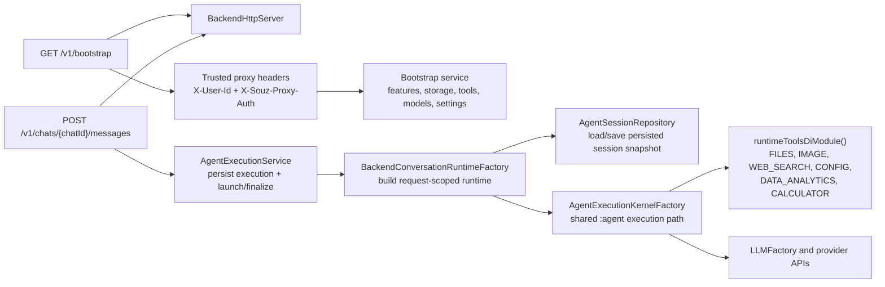

# Souz

Souz is a Kotlin Multiplatform AI assistant with a Compose Desktop host and an Android app entry point.

## Note for LLM

Keep this file updated whenever top level details changes.
If you are not sure about something, left a note for other developers to review.

### UI architecture principles

- UI layers (Screens and Composables) should not do neither business logic, nor IO operations.
- UI-logic should be coordinated from ViewModels. ViewModel may delegate business logic to UseCases.

### Development principles

- Prefer composition to inheritance.
- Do not mix coroutines with the JVM low level concurrency primitives such as: Volatile, Synchronize, ThreadLocal, etc).
- Utilize open closed principle.

## Features

- **Graph-based agent runtime** with explicit nodes, transitions, retries, and session history.
- **Standalone ClawHub/OpenClaw skills support across `:agent` and `:sharedLogic`**: bundle parsing, canonical hashing, sandbox-safe filesystem bundle loading, desktop-first single-user skill storage with backend user-scoped storage support, runtime-backed activated-skill command execution through `RunSkillCommand`, plus a Docker-bundled academic paper skill fixture seeded into runtime registry storage for sandbox testing.
- **Shared sandbox abstraction for tools and skills** in `:sharedLogic`: Android/Desktop shared contracts live under `sharedLogic/src/commonJvmMain/kotlin/ru/souz/runtime/sandbox/`, with Android SQLite-backed sandbox storage in `androidMain` and local/Docker process sandboxes in `jvmMain`.
- **Multi-model LLM integrations** for GigaChat (REST/voice), Qwen, AiTunnel, Anthropic Claude, and OpenAI APIs.
- **Provider-agnostic image tools** with shared runtime gateways and split responsibilities: `ViewImage` routes local image understanding through provider-specific vision gateways with file-size limits before any OpenAI byte loading, `GenerateImage` routes image creation through capability-based provider selection independent from the current chat model, and desktop capture stays under `DESKTOP` so screen-understanding requests chain `TakeScreenshot -> ViewImage` without activating image generation.
- **Local llama.cpp provider** with a thin native bridge, strict JSON tool contract, a RAM-gated local model catalog (Qwen plus Gemma 4 chat profiles), linked local EmbeddingGemma GGUF downloads/usage for embeddings, automatic Gemma multimodal projector downloads for local vision, background preload/warmup on local chat model selection, prompt-family-aware rendering (Qwen ChatML and Gemma 4 turns), prompt-prefix/KV reuse inside the native runtime, multimodal completion budgeting based on actual `mtmd` prompt/image token counts, settings-driven context windows for local inference within model caps, model storage under `~/.local/state/souz/models/`, and extracted native bridge libraries under `~/.local/state/souz/native/`.
- **Desktop working memory core** with SQLite-backed source events, facts, evidence, embeddings, conservative post-turn capture, explicit remember handling, slot-key replacement inside scope, cosine retrieval across active scopes, and compact memory prompt injection for future turns.
- **Desktop memory management UI** with a dedicated Memory screen for listing facts, filtering/search, manual fact create/edit, pin/unpin, retire/delete, details inspection, and evidence/raw turn review for writer-created facts.
- **Shared KMP runtime and application logic layer** in `:sharedLogic`: `commonJvmMain` carries Android/Desktop reusable settings contracts, remote provider clients, provider routing, memory models/services, sandbox contracts, skill storage, portable file/image/web/calculator tools, and `portableRuntimeToolsDiModule`; `jvmMain` keeps desktop/backend-only config storage, native local models, local/Docker process sandboxes, Office/PDF extraction, MCP stdio, speech, and desktop services.
- **Shared Android/Desktop UI logic layer** in `:sharedUI`: `commonJvmMain` carries reusable ViewModel base classes, DTO/state/effect contracts, model/key availability helpers, chat search, main/settings/setup/memory/tool/folder ViewModels, host-port contracts, attachment/path orchestration, and use cases; `jvmMain` and `androidMain` keep separate platform Compose screens and host adapters.
- **Android chat-agent entry point** using Android-specific screens from `:sharedUI` `androidMain` backed by the shared `MainViewModel` and `SettingsViewModel`, Android Keystore-backed provider key settings from `:sharedLogic`, SQLite sandbox/vector storage, shared remote LLM providers, portable runtime tools, and `GraphBasedAgent` through `AgentFacade` with no-op Android host adapters for desktop-only services.
- **Key-aware model selection in Settings**: chat, embeddings, and voice recognition model lists are filtered by configured provider keys; invalid saved selections are normalized to available providers.
- **MCP integration** over `stdio` and `http` with OAuth discovery and token refresh support.
- **Rich desktop host layer** in `:desktopApp`, wired through `:sharedUI` host ports: browser, calendar, mail, notes, desktop automation, TDLight Telegram, app launch, text/clipboard actions, audio, permissions, native keys, and desktop indexing.
- **Two-mode internet search**: quick-answer web lookup for simple factual questions and multi-step research mode with LLM-built strategy, broader source coverage, cited long-form synthesis, and automatic `.md` export for oversized reports.
- **Voice and desktop interaction** via audio recording/playback, global hotkeys, and native media key bindings.

## Project Structure

```text
.
├── docs/                                   # Project docs extracted from top-level notes
├── agent/                                  # Shared agent runtime module
├── graph-engine/                           # Shared graph DSL/runtime module
├── llms/                                   # Shared LLM contracts/helpers module
├── native/                                 # Shared local-model runtime/native bridge module
├── sharedLogic/                            # JVM runtime plus Android-safe LLM/agent support variants
│   ├── Dockerfile                          # Shared local/test Docker runtime sandbox image
│   ├── docker/                             # Docker entrypoint and bundled development skill fixtures
│   ├── src/commonJvmMain/kotlin/ru/souz/   # Android/Desktop reusable runtime contracts, remote LLMs, skills, memory, and portable tools
│   ├── src/androidMain/kotlin/ru/souz/     # Android settings plus SQLite runtime sandbox implementations
│   ├── src/jvmMain/kotlin/ru/souz/db/      # Desktop/backend ConfigStore + SettingsProviderImpl
│   ├── src/jvmMain/kotlin/ru/souz/llms/    # JVM-only local/native and voice provider integrations
│   ├── src/jvmMain/kotlin/ru/souz/runtime/ # JVM DI plus local/Docker sandbox implementations
│   ├── src/jvmMain/kotlin/ru/souz/service/ # Shared JVM services (MCP stdio/http, observability, speech, Telegram models)
│   └── src/jvmMain/kotlin/ru/souz/tool/    # JVM-only runtime tools such as Office/PDF extraction, data analytics, presentation, and web image download
├── sharedUI/                               # Shared Android/Desktop ViewModels/host ports plus separate Android and desktop Compose screens
│   ├── src/commonMain/composeResources/    # Shared localized Compose resources
│   ├── src/commonMain/kotlin/ru/souz/ui/   # Platform-neutral markdown/common primitives
│   ├── src/commonJvmMain/kotlin/ru/souz/ui/# Android/Desktop reusable UI logic, host ports, ViewModels, search, memory/tool/folder state, and use cases
│   ├── src/androidMain/kotlin/ru/souz/ui/  # Android-specific Compose routes/screens backed by common ViewModels
│   ├── src/jvmMain/kotlin/ru/souz/         # Desktop windows, AWT/Swing adapters, Telegram/local-model/support-log UI integration, and desktop screens
│   └── src/jvmTest/                        # Desktop behavior, integration, and UI/view-model tests
├── desktopApp/                             # Runnable desktop host, composition root, OS integrations, and packaging resources
│   ├── src/main/kotlin/ru/souz/            # Main.kt/TextMain.kt, DI, desktop services/tools, desktop data extraction
│   ├── src/main/kotlin/ru/souz/memory/     # Desktop SQLite memory repository and runtime bridge wiring
│   ├── src/main/resources/                 # Native libraries, icons, entitlements, scripts, support assets
│   └── build.gradle.kts                    # Compose Desktop packaging and distribution tasks
├── androidApp/                             # Android application host with sharedUI + GraphBasedAgent-backed chat flow
│   ├── src/main/kotlin/ru/souz/android/    # MainActivity and Android agent/runtime DI composition for sharedUI android screens
│   ├── src/main/res/                       # Android launcher/theme resources
│   └── build.gradle.kts                    # Android application Gradle configuration
├── backend/                                # JVM HTTP backend with shared agent runtime reuse
│   ├── src/main/kotlin/ru/souz/backend/    # app, http, agent runtime, bootstrap, config, security, storage backend packages
│   ├── src/test/kotlin/ru/souz/backend/    # Backend service/runtime tests
│   └── AGENTS.md                           # Module notes and REST contract
├── dest/                                   # Local output/scratch directory
├── scripts/                                # Build, release, and packaging helper scripts
└── gradle/                                 # Gradle version catalog and wrapper configuration
```

## Backend Flow



- Backend host adapters intentionally replace desktop-only SPI pieces with no-op implementations while keeping the same graph execution kernel.
- `/v1/**` trusts user identity only from proxy-managed headers and never from request bodies.
- Storage mode now supports `memory`, `filesystem`, and `postgres`; `memory` keeps bounded in-process snapshots (10_000 entities per repository) to reduce accidental OOM risk and now includes a lightweight `UserRepository`, `filesystem` persists `data/users/{encodedUserId}/user.json` plus per-user settings/chat product/runtime data under `SOUZ_BACKEND_DATA_DIR` / `souz.backend.dataDir` (default `data/` relative to the backend process working directory) with a stable URL-safe encoded user path segment instead of the raw opaque `userId`, while `postgres` uses JDBC + HikariCP + Flyway migrations with explicit `SOUZ_BACKEND_DB_*` / `souz.backend.db.*` settings (`host`, `port`, `name`, `user`, `password`, `schema`, `maxPoolSize`, `connectionTimeoutMs`) and defaults of `127.0.0.1`, `5432`, `souz`, `souz`, `public`, `10`, and `30000`.

## Builds

- JVM/KMP modules compile and run tests with a Java 21 Gradle toolchain from the root build script, so local Gradle can be launched from newer JDKs without emitting newer class files.
- Desktop app: `./gradlew :desktopApp:run` or the existing Compose distribution tasks under `:desktopApp`. UI/ViewModel tests live under `:sharedUI:jvmTest`; desktop host/tool/service tests live under `:desktopApp:test`. For Docker sandbox mode, build the runtime image with `./gradlew :sharedLogic:buildRuntimeSandboxImage` and run with `SOUZ_SANDBOX_MODE=docker`.
- Android app: `./gradlew :androidApp:assembleDebug` builds the Android entry point. The Android host provides one Kodein graph with Android settings/runtime bindings, and `:sharedUI` `androidMain` renders Android-specific chat/settings screens backed by common ViewModels. Android uses Android Keystore-encrypted provider key storage via SharedPreferences, SQLite-backed vector/sandbox storage, and `GraphBasedAgent` chat execution through the Android-safe `:sharedLogic` LLM runtime.
- Backend JVM app: `./gradlew :backend:run`. It binds to `127.0.0.1:8080` by default, configurable with `SOUZ_BACKEND_HOST` and `SOUZ_BACKEND_PORT`.
