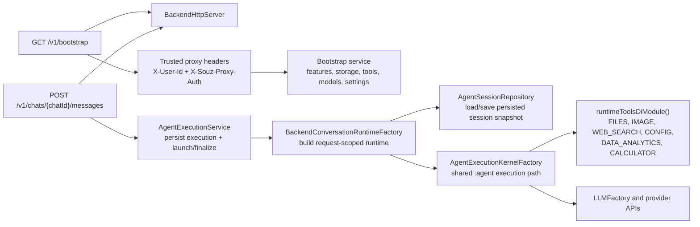

# Souz

Souz is a Kotlin Multiplatform desktop AI assistant built with Compose for Desktop.

## Note for LLM

Keep this file updated whenever top level details changes.
If you are not sure about something, left a note for other developers to review.

### UI architecture principles

- UI layers (Screens and Composables) should not do neither business logic, nor IO operations.
- UI-logic should be coordinated from ViewModels. ViewModel may delegate business logic to UseCases.

### Development principles

- Prefer composition to inheritance.
- Do not mix coroutines with the JVM low level concurrency primitives such as: Volatile, Synchronize, ThreadLocal, etc).
- Utilize open closed principle.

## Features

- **Graph-based agent runtime** with explicit nodes, transitions, retries, and session history.
- **Standalone ClawHub/OpenClaw skills support across `:agent` and `:runtime`**: bundle parsing, canonical hashing, sandbox-safe filesystem bundle loading, desktop-first single-user skill storage with backend user-scoped storage support, runtime-backed activated-skill command execution through `RunSkillCommand`, plus a Docker-bundled academic paper skill fixture seeded into runtime registry storage for sandbox testing.
- **Shared sandbox abstraction for tools and skills** in `:runtime`: sandbox filesystem/path/process contracts sit under `runtime/src/main/kotlin/ru/souz/runtime/sandbox/`.
- **Multi-model LLM integrations** for GigaChat (REST/voice), Qwen, AiTunnel, Anthropic Claude, and OpenAI APIs.
- **Provider-agnostic image tools** with shared runtime gateways and split responsibilities: `ViewImage` routes local image understanding through provider-specific vision gateways with file-size limits before any OpenAI byte loading, `GenerateImage` routes image creation through capability-based provider selection independent from the current chat model, and desktop capture stays under `DESKTOP` so screen-understanding requests chain `TakeScreenshot -> ViewImage` without activating image generation.
- **Local llama.cpp provider** with a thin native bridge, strict JSON tool contract, a RAM-gated local model catalog (Qwen plus Gemma 4 chat profiles), linked local EmbeddingGemma GGUF downloads/usage for embeddings, automatic Gemma multimodal projector downloads for local vision, background preload/warmup on local chat model selection, prompt-family-aware rendering (Qwen ChatML and Gemma 4 turns), prompt-prefix/KV reuse inside the native runtime, multimodal completion budgeting based on actual `mtmd` prompt/image token counts, settings-driven context windows for local inference within model caps, model storage under `~/.local/state/souz/models/`, and extracted native bridge libraries under `~/.local/state/souz/native/`.
- **Shared JVM runtime layer** in `:runtime` for provider clients, config/settings access, file utilities, and backend-safe tool categories (`FILES`, `IMAGE`, `IMAGE_GENERATION`, `WEB_SEARCH`, `CONFIG`, `DATA_ANALYTICS`, `CALCULATOR`) reused by both desktop and backend agent execution.
- **Key-aware model selection in Settings**: chat, embeddings, and voice recognition model lists are filtered by configured provider keys; invalid saved selections are normalized to available providers.
- **MCP integration** over `stdio` and `http` with OAuth discovery and token refresh support.
- **Rich desktop toolset** in `:composeApp` on top of the shared runtime tools: browser, calendar, mail, notes, desktop automation, Telegram, presentations, app launch, and text/clipboard actions.
- **Two-mode internet search**: quick-answer web lookup for simple factual questions and multi-step research mode with LLM-built strategy, broader source coverage, cited long-form synthesis, and automatic `.md` export for oversized reports.
- **Voice and desktop interaction** via audio recording/playback, global hotkeys, and native media key bindings.

## Project Structure

```text
.
├── docs/                                   # Project docs extracted from top-level notes
├── agent/                                  # Shared agent runtime module
├── graph-engine/                           # Shared graph DSL/runtime module
├── llms/                                   # Shared LLM contracts/helpers module
├── native/                                 # Shared local-model runtime/native bridge module
├── runtime/                                # Shared JVM runtime and backend-safe tools
│   ├── Dockerfile                          # Shared local/test Docker runtime sandbox image
│   ├── docker/                             # Docker entrypoint and bundled development skill fixtures
│   ├── src/main/kotlin/ru/souz/db/         # Config store + settings provider
│   ├── src/main/kotlin/ru/souz/llms/       # Provider APIs and runtime LLM helpers
│   ├── src/main/kotlin/ru/souz/runtime/    # Shared runtime infrastructure (sandbox, DI helpers)
│   ├── src/main/kotlin/ru/souz/service/    # Shared JVM services (currently file services)
│   ├── src/main/kotlin/ru/souz/skills/     # Safe skill bundle loading plus persistent skill/validation storage
│   └── src/main/kotlin/ru/souz/tool/       # Shared tool catalog, file/web/config/data/math tools
├── backend/                                # JVM HTTP backend with shared agent runtime reuse
│   ├── src/main/kotlin/ru/souz/backend/    # app, http, agent runtime, bootstrap, config, security, storage backend packages
│   ├── src/test/kotlin/ru/souz/backend/    # Backend service/runtime tests
│   └── AGENTS.md                           # Module notes and REST contract
├── composeApp/                             # Desktop application and OS-bound integrations
│   ├── src/jvmMain/kotlin/ru/souz/di/      # Desktop DI wiring and agent host setup
│   ├── src/jvmMain/kotlin/ru/souz/service/ # Audio, MCP, permissions, Telegram, observability, image, keys
│   ├── src/jvmMain/kotlin/ru/souz/tool/    # Desktop-only tools (browser, calendar, mail, notes, etc.)
│   ├── src/jvmMain/kotlin/ru/souz/ui/      # Compose screens, view models, and tool/settings UI
│   └── src/jvmTest/                        # JVM test source set
├── dest/                                   # Local output/scratch directory
├── build-logic/                            # Included Gradle build with convention plugins/shared build logic
└── gradle/                                 # Gradle version catalog and wrapper configuration
```

## Backend Flow



- Backend host adapters intentionally replace desktop-only SPI pieces with no-op implementations while keeping the same graph execution kernel.
- `/v1/**` trusts user identity only from proxy-managed headers and never from request bodies.
- Storage mode now supports `memory`, `filesystem`, and `postgres`; `memory` keeps bounded in-process snapshots (10_000 entities per repository) to reduce accidental OOM risk and now includes a lightweight `UserRepository`, `filesystem` persists `data/users/{encodedUserId}/user.json` plus per-user settings/chat product/runtime data under `SOUZ_BACKEND_DATA_DIR` / `souz.backend.dataDir` (default `data/` relative to the backend process working directory) with a stable URL-safe encoded user path segment instead of the raw opaque `userId`, while `postgres` uses JDBC + HikariCP + Flyway migrations with explicit `SOUZ_BACKEND_DB_*` / `souz.backend.db.*` settings (`host`, `port`, `name`, `user`, `password`, `schema`, `maxPoolSize`, `connectionTimeoutMs`) and defaults of `127.0.0.1`, `5432`, `souz`, `souz`, `public`, `10`, and `30000`.

## Builds

- Desktop KMP app: `./gradlew :composeApp:jvmRun` or the existing Compose distribution tasks. For Docker sandbox mode, build the runtime image with `./gradlew :runtime:buildRuntimeSandboxImage` and run with `SOUZ_SANDBOX_MODE=docker`.
- Backend JVM app: `./gradlew :backend:run`. It binds to `127.0.0.1:8080` by default, configurable with `SOUZ_BACKEND_HOST` and `SOUZ_BACKEND_PORT`.
