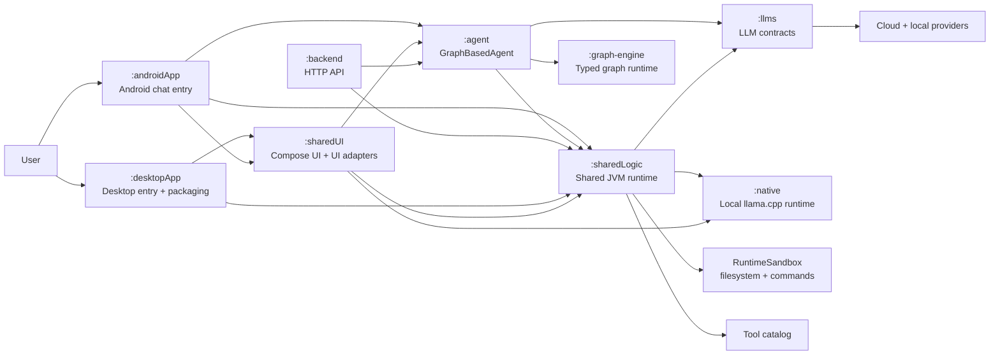
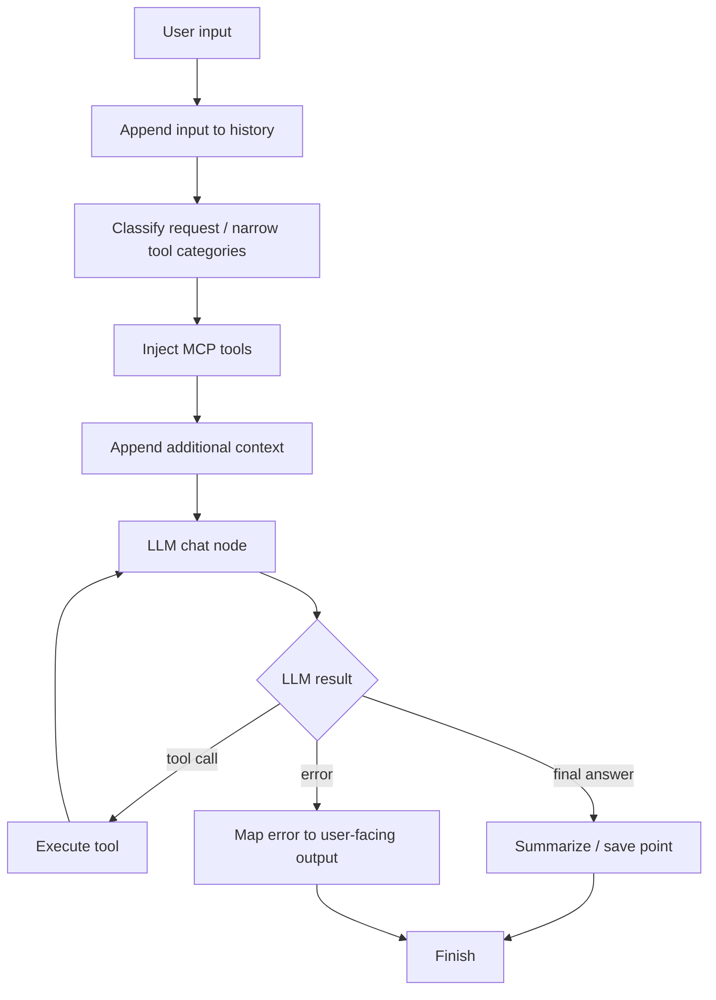
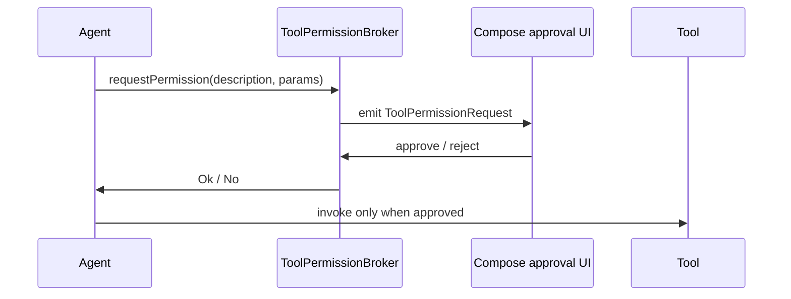

# Souz

[Website](https://souz.app) · [Releases](https://github.com/D00mch/souz/releases) · [Contributing](docs/CONTRIBUTING.md)

Souz is a Kotlin Multiplatform AI assistant focused on **safe, observable, user-approved automation**. It combines a Compose Desktop app, an Android chat-agent entry point, a reusable graph-based agent runtime, shared backend-safe tools, local and cloud LLM providers, sandbox-aware file/process access, and an HTTP backend for web/API integrations.

The project is designed around one core idea: an AI agent should be useful enough to operate your desktop and data, but transparent and constrained enough that users can trust what it is doing.

## Highlights

- **Kotlin Multiplatform app surfaces** built with Compose for Desktop plus an Android chat-agent entry point.
- **GraphBasedAgent** powered by an explicit graph runtime with classification, MCP tool injection, prompt enrichment, LLM execution, tool loops, summarization, retries, tracing, and cancellation.
- **Shared runtime layer** used by desktop and backend for LLM clients, settings/config, sandbox-aware filesystem access, and backend-safe tools, plus an Android-safe LLM runtime surface for the Android chat-agent host.
- **Sandbox abstraction** for filesystem and command execution, with local mode by default and opt-in Docker-backed execution.
- **HTTP backend** with trusted-proxy auth, per-user settings/provider keys, chat lifecycle, message execution, Telegram bot chat bindings, cancellation, option continuation, event replay, WebSocket streaming, and memory/filesystem/Postgres storage.
- **Rich desktop tool catalog** for files, browser, web search/research, config, notes, applications, data analytics, calendar, mail, text replacement, Telegram, desktop capture, presentations, and calculator.
- **SafeMode confirmations** for tool permission prompts, destructive Telegram operations, ambiguous contact/chat selection, and deferred file-modification review.
- **Multi-provider LLM support** for GigaChat, Qwen, AiTunnel, Anthropic Claude, OpenAI, and local llama.cpp models.
- **Local inference** through a packaged native bridge with Qwen/Gemma chat profiles, EmbeddingGemma embeddings, prompt-family rendering, strict JSON tool output handling, model downloads, preload/warmup, and cancellation.
- **MCP integration** over stdio/http with OAuth discovery and token refresh support.
- **Voice and desktop interaction** with audio capture/playback, speech recognition, global hotkeys, native media keys, screenshots, screen recording, and macOS integrations.
- **ClawHub/OpenClaw skill support** with bundle parsing, canonical hashing, desktop-first registry storage, backend user-scoped storage support, safe loading, LLM-backed selection, structural/static/LLM validation, validation caching, activation, and context injection.

## Installation

```bash
brew tap D00mch/tap
brew install --cask souz-ai
```

Or download the latest build from [GitHub Releases](https://github.com/D00mch/souz/releases).

## Project structure

```text
.
├── agent/                  # Shared agent contracts, GraphBasedAgent, skill activation, sessions
├── graph-engine/           # Framework-free typed graph DSL/runtime
├── llms/                   # Shared LLM DTOs, provider enums, model profiles, token logging
├── native/                 # llama.cpp bridge and local model runtime
├── sharedLogic/            # Shared JVM runtime plus Android-safe LLM/agent support variant
├── sharedUI/               # Shared Compose presentation plus desktop UI, view models, host ports, UI adapters, UI resources
├── desktopApp/             # Runnable desktop host, DI composition root, OS integrations, packaging
├── androidApp/             # Android chat-agent host over sharedUI, sharedLogic, and GraphBasedAgent
├── backend/                # Ktor HTTP backend over the shared agent runtime
├── scripts/                # Build, release, and packaging helper scripts
├── docs/                   # Project documentation
└── gradle/                 # Version catalog and wrapper configuration
```

Gradle modules included by the build:

```text
:agent
:graph-engine
:llms
:native
:sharedLogic
:sharedUI
:desktopApp
:androidApp
:backend
```

Module docs:

- [`sharedLogic/README.md`](sharedLogic/README.md) covers the shared JVM runtime layer, sandbox modes, tools, and Docker sandbox image setup.

## Architecture (module structure)



### Frontend / Desktop app

`:desktopApp` owns the runnable desktop entry point, app composition root, OS integrations, desktop-only services/tools, and Compose Desktop packaging. It depends on `:sharedLogic` and `:sharedUI`.

`:sharedUI` owns shared presentation surfaces and the desktop experience:

- Android-capable shared chat/settings presentation surface for the Android chat-agent entry point.
- Compose screens, ViewModels, app theme, reusable UI components, and setup/settings flows for desktop.
- Chat UI with model/context selectors, attachments, send/mic controls, streaming state, speech output, and graph/thinking visualization.
- Tool-management UI and permission/selection approval flows.
- Settings UI for models, provider keys, general behavior, security, folders, Telegram, sessions, visualization, and support logs.
- Host-port interfaces plus UI adapters for permission/selection flows and macOS window effects. Non-UI desktop services and OS-bound tools live in `:desktopApp`.

UI code should stay presentation-only. Business logic belongs in ViewModels or use cases.

### KMP / shared modules

Souz keeps platform-specific logic at the edges:

- `:llms` contains provider-agnostic contracts and shared model/profile definitions.
- `:graph-engine` contains no LLM/tool/agent knowledge; it only runs typed suspendable graph nodes.
- `:agent` implements agent behavior on top of the graph engine.
- `:sharedLogic` contains JVM-shared runtime services, backend-safe tools, sandbox/skills infrastructure, provider clients, shared contracts/models, and a minimal Android-safe LLM runtime surface for the Android agent host. See [`sharedLogic/README.md`](sharedLogic/README.md).
- `:native` contains local model support used by desktop and backend-capable runtime wiring.
- `:sharedUI` contains shared Compose presentation, Desktop/KMP UI, view models, UI adapters, and desktop test coverage.
- `:desktopApp` contains the runnable desktop entry points, DI composition root, OS integrations, desktop-only tools/services, and packaging resources.
- `:androidApp` contains the Android entry point, Android storage/settings adapters, and the Android bridge from shared chat UI events to `GraphBasedAgent`.
- `:backend` exposes the same runtime over HTTP without starting the desktop app.

## GraphBasedAgent

`GraphBasedAgent` is the standard tool-calling agent. Its graph is explicit and traceable:



Key behavior:

- Classification narrows tool exposure before the LLM call.
- MCP tools are injected dynamically.
- Tool calls loop back into the LLM until the model returns a final answer.
- Session history and graph steps can be persisted for replay/inspection.
- The execution delegate supports active-job cancellation and trace callbacks.
- Errors are routed through a dedicated user-facing error node.

## Graph engine

`:graph-engine` is a small framework-free runtime for composing typed suspendable Kotlin nodes.

It provides:

- `Node<IN, OUT>` as the unit of work.
- `Graph<IN, OUT>` as a node-compatible executable graph.
- Static and dynamic transitions.
- Nested graphs.
- FIFO traversal.
- Retry policies.
- Step tracing through `onStep`.
- Cancellation handling that preserves the last context.
- `maxSteps` protection against accidental loops.

Run the graph engine README example:

```bash
./gradlew :graph-engine:test --tests ru.souz.graph.GraphReadmeExampleTest
```

## Sandboxing and safety

Souz separates tool behavior from the execution environment through `RuntimeSandbox`.

```text
RuntimeSandbox
├── mode: LOCAL | DOCKER
├── scope: SandboxScope
├── runtimePaths: home, workspace, state, sessions, vector index, logs, models, native libs, skills
├── fileSystem: SandboxFileSystem
└── commandExecutor: SandboxCommandExecutor
```

The current implementations are `LocalRuntimeSandbox` and `DockerRuntimeSandbox`. Local mode is the default. Docker mode is opt-in through `SOUZ_SANDBOX_MODE=docker` and requires the `souz-runtime-sandbox:latest` image to exist locally. Build it with `./gradlew :sharedLogic:buildRuntimeSandboxImage`. Tools plus skill loading, storage, and validation depend on sandbox abstractions instead of directly assuming host access. See [`sharedLogic/README.md`](sharedLogic/README.md) for setup details.

Default state layout is under:

```text
~/.local/state/souz/
├── sessions/
├── vector-index/
├── logs/
├── models/
├── native/
├── skills/
└── skill-validations/
```

Safety mechanisms include:

- SafeMode permission prompts before sensitive tool execution.
- User approval UI for pending tool requests.
- Deferred review flow for file modifications.
- Confirmation requirement for destructive Telegram operations.
- Ambiguity dialogs for Telegram contact/chat selection.
- Backend tool restriction to backend-safe categories.
- Trusted-proxy identity only for backend `/v1/**` routes.
- Durable tool-call audit rows in the backend with redacted/truncated previews.
- Opt-in Docker runtime sandbox mode for local app runs and integration tests.

## Tool catalog

Souz has two tool catalogs:

- **Desktop catalog** in `:desktopApp`, composed with shared runtime tools and surfaced through `:sharedUI` approval flows.
- **Runtime/backend-safe catalog** in `:sharedLogic`, reusable by `:backend` without instantiating desktop-only services.

### Desktop tools

| Category | Tools |
|---|---|
| Files | List files, find text in files, create file, delete file, modify file, move file, extract text, find files by name, read PDF pages, open file/path, find folders |
| Browser | Create new browser tab, Safari info, browser hotkeys, focus tab, Chrome info, open default browser |
| Web search | Quick internet search, multi-step internet research, web image search, web page text extraction |
| Config | Sound config, sound config diff, instruction store |
| Notes | Open note, create note, delete note, list notes, search notes |
| Applications | Show installed apps, open app/file/path |
| Data analytics | Create plot from CSV, upload file, download file, read Excel, generate Excel report |
| Calendar | Create event, delete event, list calendars, list events |
| Mail | Count unread messages, list messages, read message, reply, send new message, search mail |
| Text / clipboard | Get clipboard, replace selected text, read selected text |
| Calculator | Calculator |
| Telegram | Read inbox, get chat history, set chat state, send message/attachment, forward message, search Telegram, save to Saved Messages |
| Desktop | Take screenshot, start screen recording |
| Presentation | Create presentation, read presentation, list/find files for presentation workflows |

### Backend-safe runtime tools

The backend-safe catalog avoids desktop-only APIs and includes:

| Category | Tools |
|---|---|
| Files | List/find/create/delete/modify/move files, extract text, find files, read PDF pages, find folders |
| Web search | Internet search, internet research, optional web image search, web page text |
| Config | Sound config, sound config diff |
| Data analytics | CSV plotting, Excel read, Excel report |
| Calculator | Calculator |

The backend intentionally excludes desktop automation, browser control, Mail, Calendar, Notes, desktop Telegram tools, presentation UI integrations, and other OS-bound tools. It separately supports Telegram bot chat bindings for text ingress into existing backend chats.

## UI confirmations and approval flows

Souz treats tool execution as an interactive workflow instead of a hidden side effect.



Confirmation-related flows:

- `ToolPermissionBroker` serializes SafeMode permission prompts and waits for the user decision.
- `PermissionsUseCase` listens to generic tool permission requests and selection approval sources.
- `ToolModifyReviewUseCase` manages deferred file-modification review/approval inside chat messages.
- Telegram tools use selection brokers for ambiguous fuzzy contact/chat matches.
- Destructive Telegram operations require explicit confirmation before continuing.

## Backend

`:backend` is a JVM Ktor server that exposes the shared agent runtime over HTTP.

### Routes

| Route | Purpose |
|---|---|
| `GET /health` | Process and selected-model status |
| `GET /v1/bootstrap` | Features, storage mode, visible models/tools, effective trusted-user settings |
| `GET /v1/me/settings` | Read public user settings |
| `PATCH /v1/me/settings` | Persist public user settings |
| `GET /v1/me/provider-keys` | List configured provider-key state |
| `PUT /v1/me/provider-keys/{provider}` | Store encrypted provider key |
| `DELETE /v1/me/provider-keys/{provider}` | Delete provider key |
| `GET /v1/chats` | List owned chats |
| `POST /v1/chats` | Create chat |
| `PATCH /v1/chats/{chatId}/title` | Rename chat |
| `POST /v1/chats/{chatId}/archive` | Archive chat |
| `POST /v1/chats/{chatId}/unarchive` | Unarchive chat |
| `GET /v1/chats/{chatId}/messages` | List visible product messages |
| `POST /v1/chats/{chatId}/messages` | Create user message and start/complete agent execution |
| `GET /v1/chats/{chatId}/telegram-bot` | Read Telegram bot binding state for an owned chat |
| `PUT /v1/chats/{chatId}/telegram-bot` | Validate and upsert a Telegram bot binding for an owned chat |
| `DELETE /v1/chats/{chatId}/telegram-bot` | Remove the Telegram bot binding from an owned chat |
| `GET /v1/chats/{chatId}/events` | Replay durable chat events |
| `WS /v1/chats/{chatId}/ws` | Replay and subscribe to live chat events |
| `POST /v1/options/{optionId}/answer` | Resume execution after a pending option is answered |
| `POST /v1/chats/{chatId}/cancel-active` | Cancel active execution |
| `POST /v1/chats/{chatId}/executions/{executionId}/cancel` | Cancel a specific execution |

### Backend safety model

- `/v1/**` trusts identity only from proxy-managed headers:
  - `X-User-Id`
  - `X-Souz-Proxy-Auth`
- `X-User-Id` is treated as opaque and provisioned through `UserRepository.ensureUser(userId)`.
- Request bodies are never trusted for user identity.
- Each chat, execution, option, and setting is scoped to the trusted user.
- Backend host adapters replace desktop-only services with no-op implementations.
- The backend uses the same shared agent execution kernel as desktop.

### Storage modes

| Mode | Description |
|---|---|
| `memory` | Bounded in-process repositories, useful for local/dev execution |
| `filesystem` | Per-user files under `SOUZ_BACKEND_DATA_DIR` / `souz.backend.dataDir` |
| `postgres` | JDBC + HikariCP + Flyway-backed durable storage |

Postgres storage supports durable event replay, per-chat message/event sequence numbers, one active execution per chat, optimistic locking for `agent_conversation_state`, and durable tool-call audit rows.
Telegram bot bindings are available in all backend storage modes. Bot tokens are encrypted at rest via `TELEGRAM_TOKEN_ENCRYPTION_KEY`, pending links use one-time `/start <secret>` commands with only the secret hash stored server-side, and binding setup drops pending Telegram updates before long polling starts.

### Backend configuration

```bash
# Server
SOUZ_BACKEND_HOST=127.0.0.1
SOUZ_BACKEND_PORT=8080

# Feature flags
SOUZ_FEATURE_WS_EVENTS=true
SOUZ_FEATURE_STREAMING_MESSAGES=true
SOUZ_FEATURE_TOOL_EVENTS=true
SOUZ_FEATURE_OPTIONS=true
SOUZ_FEATURE_DURABLE_EVENT_REPLAY=false

# Storage
SOUZ_STORAGE_MODE=filesystem
SOUZ_BACKEND_DATA_DIR=data

# Postgres
SOUZ_BACKEND_DB_HOST=127.0.0.1
SOUZ_BACKEND_DB_PORT=5432
SOUZ_BACKEND_DB_NAME=souz
SOUZ_BACKEND_DB_USER=souz
SOUZ_BACKEND_DB_PASSWORD=...
SOUZ_BACKEND_DB_SCHEMA=public
SOUZ_BACKEND_DB_MAX_POOL_SIZE=10
SOUZ_BACKEND_DB_CONNECTION_TIMEOUT_MS=30000
```

Run the backend:

```bash
./gradlew :backend:run
```

By default it binds to `127.0.0.1:8080`.

## Skills

Souz supports standalone ClawHub/OpenClaw-style skill bundles across `:agent` and `:sharedLogic`.

Skill pipeline:

```mermaid
flowchart LR
    skillList["List user skills"] --> skillSelect["Select skills\nmetadata + LLM"]
    skillSelect --> skillLoad["Load selected bundle"]
    skillLoad --> skillHash["Canonical hash"]
    skillHash --> validationCache["Validation cache lookup"]
    validationCache --> structuralValidation["Structural validation"]
    structuralValidation --> staticValidation["Static validation"]
    staticValidation --> llmValidation["LLM validation"]
    llmValidation --> skillActivate["Activate skill"]
    skillActivate --> skillInject["Inject skill context"]
```



Skill safety and storage:

- Bundles are loaded through safe filesystem access.
- Desktop/local skills are persisted under `~/.local/state/souz/skills/{skillId}/`, with immutable bundles in `bundles/{bundleHash}/` and metadata in `stored-skill.json`.
- Desktop/local validation records are persisted separately under `~/.local/state/souz/skill-validations/{skillId}/policies/{policy}/`.
- Backend storage keeps the user-scoped scope available under `skills/users/{encodedUserId}/skills/{skillId}/` and `skill-validations/users/{encodedUserId}/skills/{skillId}/`.
- Validation cache keys include user id, skill id, bundle hash, and policy version.
- Stale validations are invalidated when the active bundle hash changes.
- Selected skills are activated only after structural, static, and LLM validation pass.

## LLM providers

Souz supports:

- GigaChat REST and voice APIs.
- Qwen.
- AiTunnel.
- Anthropic Claude.
- OpenAI.
- Local llama.cpp models through `:native`.

Provider/model selection is key-aware: chat, embeddings, and voice-recognition model lists are filtered by configured provider keys, and invalid saved selections are normalized to available providers.

## Local models

`:native` provides local model execution through a JNA bridge into a packaged llama.cpp-based native library.

Features:

- macOS arm64 and x64 packaged bridge binaries.
- Qwen and Gemma chat profiles.
- Linked EmbeddingGemma GGUF asset for embeddings.
- Model storage under `~/.local/state/souz/models/`.
- Native bridge extraction under `~/.local/state/souz/native/`.
- Background preload/warmup when selecting a local chat model.
- Settings-driven context windows capped by model limits.
- Prompt rendering for Qwen ChatML and Gemma 4 turn formats.
- Strict JSON tool-call contract and output recovery/parsing.
- Prompt-prefix/KV reuse in the native runtime.
- Local generation and embeddings cancellation support.

Rebuild packaged bridge binaries:

```bash
desktopApp/src/main/resources/scripts/build-llama-bridge.sh
```

## MCP

Souz can connect to external tools through Model Context Protocol:

- stdio transport.
- HTTP transport.
- OAuth discovery.
- Token refresh.
- Dynamic MCP tool injection into the agent graph.

## Web research

Souz has two web modes:

- **Internet search** for quick factual answers.
- **Internet research** for multi-step synthesis with LLM-built strategy, broader source coverage, citations, and automatic Markdown export for oversized reports.

## Development

Recommended IntelliJ IDEA plugins:

- Kotlin Multiplatform
- Compose Multiplatform
- Compose Multiplatform desktop support, optional

Run the desktop app:

```bash
./gradlew :desktopApp:run
```

Run desktop tests:

```bash
./gradlew :sharedUI:cleanJvmTest :sharedUI:jvmTest
```

Run agent integration scenarios:

```bash
export SOUZ_AGENT_INTEGRATION_TESTS_ON=true
./gradlew :sharedUI:cleanJvmTest :sharedUI:jvmTest --tests "agent.GraphAgentComplexScenarios"
```

Run backend tests:

```bash
./gradlew :backend:test
```

Run all checks:

```bash
./gradlew check
```

## Release builds

Useful release scripts:

```bash
# Prepare universal macOS app bundle
scripts/kmp-build-macos-universal.sh

# Build notarized arch-specific DMGs and export to dest/homebrew/<version>/
scripts/kmp-build-macos-dev.sh

# Generate Homebrew cask from exported DMGs
scripts/prepare-homebrew-release.sh
```

See JetBrains Compose Multiplatform release docs for signing and notarization details.

## Development principles

- Prefer composition over inheritance.
- Keep UI free of business logic and IO.
- Coordinate UI logic from ViewModels and delegate domain work to use cases.
- Avoid mixing coroutines with low-level JVM concurrency primitives unless there is a clear boundary.
- Use open/closed design for tools, providers, and runtime adapters.
- Keep Compose/UI dependencies out of `:sharedLogic`; backend wiring should avoid desktop-only service/tool implementations.
- Read the nearest `AGENTS.md` before editing a module or nested package.

## Related reading

- [How to Build AI Agents You Can Actually Trust](https://medium.com/@liverm0r/building-ai-agents-for-non-technical-users-50d24c3184a8)
- [Russian version on Habr](https://habr.com/ru/articles/1010236/)

## License

Copyright © 2026 Artur Dumchev and Shamil Khizriev

This program and the accompanying materials are made available under the terms of the Eclipse Public License 2.0 which is available at http://www.eclipse.org/legal/epl-2.0.

This Source Code may also be made available under the following Secondary Licenses when the conditions for such availability set forth in the Eclipse Public License, v. 2.0 are satisfied: GNU General Public License as published by the Free Software Foundation, either version 2 of the License, or (at your option) any later version, with the GNU Classpath Exception which is available at https://www.gnu.org/software/classpath/license.html.
