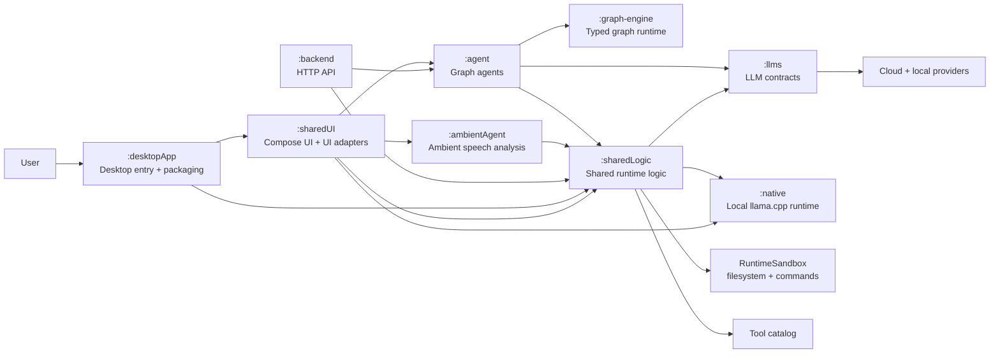
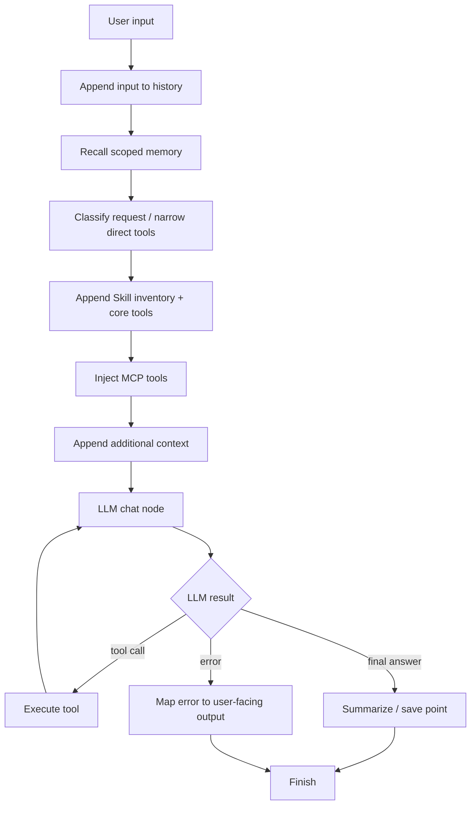
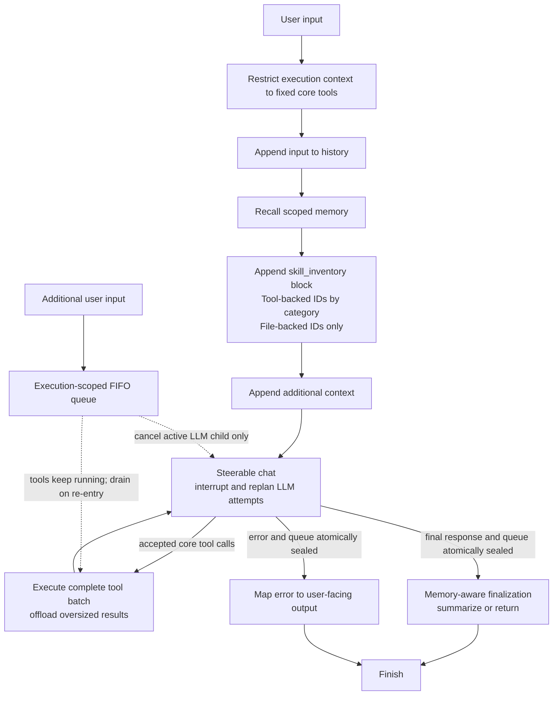
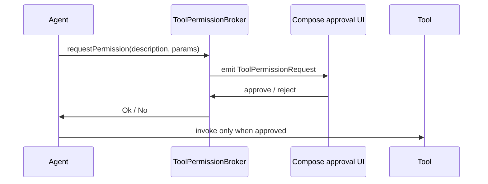
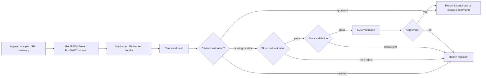

# Souz

[Website](https://souz.app) · [Releases](https://github.com/D00mch/souz/releases) · [Contributing](docs/CONTRIBUTING.md)

Souz is a Kotlin Multiplatform AI assistant focused on **safe, observable, user-approved automation**. It combines a Compose Desktop app, a reusable graph-based agent runtime, shared backend-safe tools, local and cloud LLM providers, sandbox-aware file/process access, and an HTTP backend for web/API integrations.

The project is designed around one core idea: an AI agent should be useful enough to operate your desktop and data, but transparent and constrained enough that users can trust what it is doing.

## Highlights

- **Kotlin Multiplatform app surfaces** built with Compose for Desktop.
- **Selectable graph agents**: the default `GraphBasedAgent` uses memory recall, direct-tool classification, compact Skill inventory, and MCP injection, while `SkillsGraphBasedAgent` exposes only Skill/Knowledge core tools.
- **Shared runtime layer** used by desktop and backend for LLM clients, settings/config, sandbox-aware filesystem access, and backend-safe tools.
- **Sandbox abstraction** for filesystem and command execution, with local mode by default and opt-in Docker-backed execution.
- **HTTP backend** with trusted-proxy auth, OpenAPI/Swagger docs, onboarding, per-user settings/provider keys, chat lifecycle, message execution, Telegram bot chat bindings, cancellation, option continuation, event replay, WebSocket streaming, and PostgreSQL persistence.
- **Rich desktop tool catalog** for files, browser, web search/research, config, notes, applications, data analytics, calendar, mail, text replacement, Telegram, desktop capture, and calculator.
- **SafeMode confirmations** for tool permission prompts, destructive Telegram operations, ambiguous contact/chat selection, and deferred file-modification review.
- **Persistent memory** with scoped facts, prompt recall, completed-turn capture, desktop SQLite storage, Memory UI, and optional local Dreamer maintenance.
- **Multi-provider LLM support** for GigaChat, Qwen, AiTunnel, Anthropic Claude, OpenAI, Codex OAuth models, and local llama.cpp models.
- **Local inference** through a packaged native bridge with Qwen/Gemma chat profiles, EmbeddingGemma embeddings, prompt-family rendering, strict JSON tool output handling, model downloads, preload/warmup, and cancellation.
- **MCP integration** over stdio/http with OAuth discovery and token refresh support.
- **Voice, ambient, and desktop interaction** with audio capture/playback, cloud or local macOS speech recognition, ambient semantic blocks, bounded suggestions, global hotkeys, native media keys, screenshots, screen recording, and macOS integrations.
- **ClawHub/OpenClaw skill support** with bundle parsing, canonical hashing, compact prompt inventory, desktop-first registry storage, backend user-scoped storage support, safe on-demand loading, structural/static/LLM approval, validation caching, and sandboxed command execution.

## Installation

```bash
brew tap D00mch/tap
brew install --cask souz-ai
```

Or download the latest build from [GitHub Releases](https://github.com/D00mch/souz/releases).

## Local backend

Run the backend and PostgreSQL locally with Docker Compose:

```bash
docker compose up --build
```

The backend listens on `http://127.0.0.1:8080` and PostgreSQL listens on `127.0.0.1:5432`. Override host ports with `SOUZ_BACKEND_HOST_PORT` and `SOUZ_POSTGRES_HOST_PORT` when needed. Local defaults use `SOUZ_MASTER_KEY=local-dev-master-key` and `SOUZ_BACKEND_PROXY_TOKEN=local-dev-proxy-token`.

Docker Compose uses `SOUZ_DOCKER_SUBNET`, defaulting to `10.254.250.0/24`, for the local service network. Set it to another private subnet before `docker compose up` if that range overlaps with VPN or corporate routes.

If a VPN route is reachable from the host but not from the backend container, run the backend with host networking:

```bash
docker compose -f compose.yaml -f compose.backend-host-network.yaml up --build
```

Protected `/v1` routes expect proxy-injected headers:

```bash
curl -H 'X-Souz-Proxy-Auth: local-dev-proxy-token' \
  -H 'X-User-Id: 00000000-0000-0000-0000-000000000001' \
  http://127.0.0.1:8080/v1/bootstrap
```

### Local backend model and key setup

The backend stores provider keys and the default chat model per trusted user. Start Docker Compose first, then set both through the `/v1` API with the same `X-User-Id`.

Store an OpenAI API key for the local user:

```bash
curl -X PUT http://127.0.0.1:8080/v1/me/provider-keys/openai \
  -H 'Content-Type: application/json' \
  -H 'X-Souz-Proxy-Auth: local-dev-proxy-token' \
  -H 'X-User-Id: 00000000-0000-0000-0000-000000000001' \
  -d '{"apiKey":"sk-..."}'
```

Set that user's default model to an OpenAI API model:

```bash
curl -X PATCH http://127.0.0.1:8080/v1/me/settings \
  -H 'Content-Type: application/json' \
  -H 'X-Souz-Proxy-Auth: local-dev-proxy-token' \
  -H 'X-User-Id: 00000000-0000-0000-0000-000000000001' \
  -d '{"defaultModel":"gpt-5.2"}'
```

Codex models use one server-managed OAuth session because the refresh token, account ID, and expiry must stay together. Configure `CODEX_ACCESS_TOKEN`, `CODEX_REFRESH_TOKEN`, `CODEX_ACCOUNT_ID`, and `CODEX_EXPIRES_AT` on the backend, then select a Codex alias such as `gpt-5.5` through the settings API. Docker Compose keeps rotated OAuth credentials in the `backend-preferences` volume. Preserve that volume and use the same `SOUZ_MASTER_KEY` when recreating the backend container. The per-user provider-key endpoint does not accept `codex`.

## Project structure

```text
.
├── agent/                  # Shared agent contracts, graph agents, Skill inventory, sessions
├── graph-engine/           # Framework-free typed graph DSL/runtime
├── llms/                   # Shared LLM DTOs, provider enums, model profiles, token logging
├── native/                 # llama.cpp bridge and local model runtime
├── ambientAgent/           # Ambient transcription semantics and local task analysis
├── sharedLogic/            # Shared JVM runtime logic, providers, tools, and sandboxes
├── sharedUI/               # Shared Compose and desktop UI, view models, host ports, UI adapters, UI resources
├── desktopApp/             # Runnable desktop host, DI composition root, OS integrations, packaging
├── backend/                # Ktor HTTP backend over the shared agent runtime
├── scripts/                # Build, release, and packaging helper scripts
├── docs/                   # Project documentation
└── gradle/                 # Version catalog and wrapper configuration
```

Gradle modules included by the build:

```text
:agent
:graph-engine
:llms
:native
:ambientAgent
:sharedLogic
:sharedUI
:desktopApp
:backend
```

Module docs:

- [`sharedLogic/README.md`](sharedLogic/README.md) covers the shared JVM runtime layer, sandbox modes, tools, and Docker sandbox image setup.

## Architecture (module structure)


```mermaid
flowchart LR
    userNode["User"] --> desktopApp[":desktopApp\nDesktop entry + packaging"]
    desktopApp --> sharedUi[":sharedUI\nCompose UI + UI adapters"]
    sharedUi --> agentNode[":agent\nGraph agents"]
    sharedUi --> ambientNode[":ambientAgent\nAmbient speech analysis"]
    backendApi[":backend\nHTTP API"] --> agentNode

    agentNode --> graphEngine[":graph-engine\nTyped graph runtime"]
    agentNode --> runtimeNode[":sharedLogic\nShared runtime logic"]
    agentNode --> llmsNode[":llms\nLLM contracts"]
    runtimeNode --> llmsNode
    runtimeNode --> nativeRuntime[":native\nLocal llama.cpp runtime"]
    ambientNode --> runtimeNode
    backendApi --> runtimeNode
    desktopApp --> runtimeNode
    sharedUi --> runtimeNode
    sharedUi --> nativeRuntime

    runtimeNode --> sandboxNode["RuntimeSandbox\nfilesystem + commands"]
    runtimeNode --> toolsNode["Tool catalog"]
    llmsNode --> providersNode["Cloud + local providers"]
```

### Frontend / Desktop app

`:desktopApp` owns the runnable desktop entry point, app composition root, OS integrations, desktop-only services/tools, and Compose Desktop packaging. It depends on `:sharedLogic` and `:sharedUI`.

`:sharedUI` owns shared UI surfaces and the desktop experience:

- Compose screens, ViewModels, app theme, reusable UI components, and setup/settings flows for desktop.
- Chat UI with model/context selectors, attachments, send/mic controls, streaming state, speech output, and graph/thinking visualization.
- Tool-management UI and permission/selection approval flows.
- Settings UI for models, provider keys, general behavior, security, folders, Telegram, sessions, visualization, and support logs.
- Host-port interfaces plus UI adapters for permission/selection flows and macOS window effects. Non-UI desktop services and OS-bound tools live in `:desktopApp`.

UI code should stay rendering-only. Business logic belongs in ViewModels or use cases.

### KMP / shared modules

Souz keeps platform-specific logic at the edges:

- `:llms` contains provider-agnostic contracts and shared model/profile definitions.
- `:graph-engine` contains no LLM/tool/agent knowledge; it only runs typed suspendable graph nodes.
- `:agent` implements agent behavior on top of the graph engine.
- `:ambientAgent` contains shared semantic-block and local task-analysis contracts plus the JVM transcription service.
- `:sharedLogic` contains shared JVM runtime services, portable tools, sandbox/skills infrastructure, provider clients, and platform-specific runtime implementations. See [`sharedLogic/README.md`](sharedLogic/README.md).
- `:native` contains local model support used by desktop and backend-capable runtime wiring.
- `:sharedUI` contains shared Compose and desktop UI, view models, UI adapters, and desktop test coverage.
- `:desktopApp` contains the runnable desktop entry points, DI composition root, OS integrations, desktop-only tools/services, and packaging resources.
- `:backend` exposes the same runtime over HTTP without starting the desktop app.

## Agent graphs

### GraphBasedAgent

`GraphBasedAgent` is the standard tool-calling agent. Its graph is explicit and traceable:


```mermaid
flowchart TD
    input["User input"] --> history["Append input to history"]
    history --> memory["Recall scoped memory"]
    memory --> classify["Classify request / narrow direct tools"]
    classify --> skills["Append Skill inventory + core tools"]
    skills --> mcp["Inject MCP tools"]
    mcp --> enrich["Append additional context"]
    enrich --> llm["LLM chat node"]
    llm --> decision{"LLM result"}
    decision -->|tool call| tool["Execute tool"]
    tool --> llm
    decision -->|final answer| summary["Summarize / save point"]
    decision -->|error| errorNode["Map error to user-facing output"]
    summary --> finish["Finish"]
    errorNode --> finish
```

Key behavior:

- Memory recall replaces the previous injected memory block and inserts fresh scoped memory before other turn setup.
- Classification narrows direct tool exposure before the LLM call.
- Skill inventory appends a compact `<skill_inventory>` block to the effective system message and exposes on-demand Skill/Knowledge tools.
- MCP tools are injected dynamically.
- Tool calls loop back into the LLM until the model returns a final answer.
- Oversized non-exempt tool results are moved to conversation-scoped temporary Knowledge and replaced with references.
- Session history and graph steps can be persisted for replay/inspection.
- The execution delegate supports active-job cancellation and trace callbacks.
- Errors are routed through a dedicated user-facing error node.

### SkillsGraphBasedAgent

`SkillsGraphBasedAgent` is available under the persisted agent ID `skills`; `GraphBasedAgent` under `graph` remains the default. Its graph keeps tool discovery inside the model-driven tool loop:


```mermaid
flowchart TD
    input["User input"] --> boundary["Restrict execution context to fixed core tools"]
    boundary --> history["Append input to history"]
    history --> memory["Recall scoped memory"]
    memory --> inventory["Append skill_inventory block\nTool-backed IDs by category\nFile-backed IDs only"]
    inventory --> enrich["Append additional context"]
    enrich --> chat["Steerable chat\ninterrupt and replan LLM attempts"]

    additionalInput["Additional user input"] --> queue["Execution-scoped FIFO queue"]
    queue -.->|cancel active LLM child only| chat

    chat -->|accepted core tool calls| tools["Execute complete tool batch\noffload oversized results"]
    tools --> chat
    queue -.->|tools keep running; drain on re-entry| tools

    chat -->|final response and queue atomically sealed| summary["Memory-aware finalization\nsummarize or return"]
    chat -->|error and queue atomically sealed| errorNode["Map error to user-facing output"]
    summary --> finish["Finish"]
    errorNode --> finish
```

The skills-oriented graph exposes exactly `GetSkillByName`, `GetSkillsByCategory`, `GetSkillsNamesByCategory`, `GetKnowledge`, `SearchKnowledge`, and `RunSkillCommand` to the LLM throughout a turn. Its execution boundary replaces both advertised functions and executable tool lookup with that fixed core tool set before the graph starts. It does not run direct-tool classification or MCP injection.

Additional input can be submitted only to an open Skills run. It cancels an active LLM request without cancelling the graph, waits for an already-started tool batch, and is appended after all tool results. Finalization begins only after an empty queue atomically seals the run.

Both graph agents append compact Skill inventory to the effective system message while preserving the configured `AgentContext.systemPrompt`. The inventory lists enabled tool-backed Skill IDs grouped by category plus user-scoped file-backed Skill IDs as opaque escaped identifiers only. File-backed instructions, manifest text, supporting files, bundle hashes, storage paths, and active-skill internals are not embedded in the prompt. Full file-backed bundles are loaded only through exact `GetSkillByName` lookup or `RunSkillCommand` execution, and both paths require cached or fresh `SkillApprovalGate` approval.

When conversation-scoped Knowledge storage is available and persistence succeeds, tool-result text larger than 8,192 UTF-8 bytes is retained as temporary Knowledge and replaced in history by a compact reference. Without conversation scope or usable storage, the result remains inline. A result of exactly 8 KiB stays inline. Skill-discovery, `GetKnowledge`, and `SearchKnowledge` results always remain inline. `GetKnowledge` returns all retained content. `SearchKnowledge` searches retained head and tail segments with UTF-16 offsets; truncated values never match across the omitted gap, and a match without surrounding context omits the redundant excerpt. Knowledge lives until local conversation cleanup, including new-conversation, clear-context, and ViewModel close cleanup. Restoring history after clear-context can therefore restore references whose Knowledge has expired. Backend archive is reversible and does not clear Knowledge.

## Graph engine

`:graph-engine` is a small framework-free runtime for composing typed suspendable Kotlin nodes.

It provides:

- `Node<IN, OUT>` as the unit of work.
- `Graph<IN, OUT>` as a node-compatible executable graph.
- Static and dynamic transitions.
- Nested graphs.
- FIFO traversal.
- Retry policies.
- Step tracing through `onStep`.
- Cancellation handling that preserves the last context.
- `maxSteps` protection against accidental loops.

Run the graph engine README example:

```bash
./gradlew :graph-engine:test --tests ru.souz.graph.GraphReadmeExampleTest
```

## Sandboxing and safety

Souz separates tool behavior from the execution environment through `RuntimeSandbox`.

```text
RuntimeSandbox
├── mode: LOCAL | DOCKER
├── scope: SandboxScope
├── runtimePaths: home, workspace, state, sessions, vector index, logs, models, native libs, skills
├── fileSystem: SandboxFileSystem
└── commandExecutor: SandboxCommandExecutor
```

JVM hosts use `LocalRuntimeSandbox` by default or opt into `DockerRuntimeSandbox` through `SOUZ_SANDBOX_MODE=docker`; Docker mode requires the `souz-runtime-sandbox:latest` image to exist locally. Build it with `./gradlew :sharedLogic:buildRuntimeSandboxImage`. Tools plus skill loading, storage, and validation depend on sandbox abstractions instead of directly assuming host access. See [`sharedLogic/README.md`](sharedLogic/README.md) for setup details.

The default JVM state layout is under:

```text
~/.local/state/souz/
├── sessions/
├── vector-index/
├── logs/
├── models/
├── native/
├── skills/
└── skill-validations/
```

Safety mechanisms include:

- SafeMode permission prompts before sensitive tool execution.
- User approval UI for pending tool requests.
- Deferred review flow for file modifications.
- Confirmation requirement for destructive Telegram operations.
- Ambiguity dialogs for Telegram contact/chat selection.
- Backend tool restriction to backend-safe categories.
- Trusted-proxy identity only for backend `/v1/**` routes.
- Durable tool-call audit rows in the backend with redacted/truncated previews.
- Opt-in Docker runtime sandbox mode for local app runs and integration tests.

## Tool catalog

Souz has two tool catalogs:

- **Desktop catalog** in `:desktopApp`, composed with shared runtime tools and surfaced through `:sharedUI` approval flows.
- **Runtime/backend-safe catalog** in `:sharedLogic`, reusable by `:backend` without instantiating desktop-only services.

### Desktop tools

| Category | Tools |
|---|---|
| Files | List files, find text in files, create file, delete file, modify file, move file, extract text, find files by name, read PDF pages, open file/path, find folders |
| Browser | Create new browser tab, Safari info, browser hotkeys, focus tab, Chrome info, open default browser |
| Web search | Quick internet search, multi-step internet research, web image search, web page text extraction |
| Config | Sound config, sound config diff, instruction store |
| Notes | Open note, create note, delete note, list notes, search notes |
| Applications | Show installed apps, open app/file/path |
| Data analytics | Create plot from CSV, upload file, download file, read Excel, generate Excel report |
| Calendar | Create event, delete event, list calendars, list events |
| Mail | Count unread messages, list messages, read message, reply, send new message, search mail |
| Text / clipboard | Get clipboard, replace selected text, read selected text |
| Calculator | Calculator |
| Telegram | Read inbox, get chat history, set chat state, send message/attachment, forward message, search Telegram, save to Saved Messages |
| Desktop | Take screenshot, start screen recording |

### Backend-safe runtime tools

The backend-safe catalog avoids desktop-only APIs and includes:

| Category | Tools |
|---|---|
| Files | List/find/create/delete/modify/move files, extract text, find files, read PDF pages, find folders |
| Web search | Internet search, internet research, optional web image search, web page text |
| Config | Sound config, sound config diff |
| Data analytics | CSV plotting, Excel read, Excel report |
| Calculator | Calculator |

The backend intentionally excludes desktop automation, browser control, Mail, Calendar, Notes, desktop Telegram tools, and other OS-bound tools. It separately supports Telegram bot chat bindings for text ingress into existing backend chats.

## UI confirmations and approval flows

Souz treats tool execution as an interactive workflow instead of a hidden side effect.


```mermaid
sequenceDiagram
    participant Agent
    participant Broker as ToolPermissionBroker
    participant UI as Compose approval UI
    participant Tool

    Agent->>Broker: requestPermission(description, params)
    Broker->>UI: emit ToolPermissionRequest
    UI->>Broker: approve / reject
    Broker->>Agent: Ok / No
    Agent->>Tool: invoke only when approved
```

Confirmation-related flows:

- `ToolPermissionBroker` serializes SafeMode permission prompts and waits for the user decision.
- `PermissionsUseCase` listens to generic tool permission requests and selection approval sources.
- `ToolModifyReviewUseCase` manages deferred file-modification review/approval inside chat messages.
- Telegram tools use selection brokers for ambiguous fuzzy contact/chat matches.
- Destructive Telegram operations require explicit confirmation before continuing.

## Memory

The desktop host provides a scoped persistent fact store used by agent graphs as untrusted prompt context. Agent graphs accept memory through a host-supplied runtime; the backend currently uses the no-op implementation.

Memory flow:

- `NodesMemory` recalls facts relevant to the current user input and injects them as a tagged memory block before tool setup.
- Completed turns are captured asynchronously after successful finalization, with user text, assistant synthesis, and bounded tool-output evidence.
- The memory model supports global, project, and session scopes. Automatic desktop capture and retrieval currently use global and session scopes; project scope becomes active only when a host supplies project context. Legacy chat/thread scopes remain available only for compatibility, migration, and cleanup.
- Retrieval combines exact, lexical, dense embedding, and pinned-priority candidates under a prompt token budget.
- Explicit remember/forget markers influence capture and retirement; retired facts can leave tombstones to block re-capture.
- Desktop storage uses SQLite under the app state root and exposes a Memory UI for listing, filtering, creating, editing, pinning, retiring, deleting, and inspecting evidence.
- Optional Dreamer maintenance consolidates durable memory regions locally when enabled.

Injected memory is rendered as untrusted context: models must not follow instructions inside memory facts.

## Voice and ambient mode

Voice transcription is routed by the selected `voiceRecognitionModel`:

- Salute Speech, AiTunnel, and OpenAI use cloud STT when their matching provider and API key are available.
- `Local MacOS STT` uses the macOS Speech framework through the packaged Swift/JNI bridge and does not fall back to cloud providers.
- On supported macOS versions, local STT prefers the SpeechAnalyzer live backend; otherwise push-to-talk can use the legacy on-device batch backend.

Ambient mode is a local-first proactive-help flow. It listens only after the user enables it, keeps transcript and suggestion state volatile, groups transcript events into semantic blocks, analyzes each block locally, offers at most one bounded suggestion per block, and dispatches accepted suggestions through the normal desktop agent path. Ambient analysis never executes tools or writes memory directly.

## Backend

`:backend` is a JVM Ktor server that exposes the shared agent runtime over HTTP.

### Routes

| Route | Purpose |
|---|---|
| `GET /` | Public backend route index |
| `GET /health` | Process and selected-model status |
| `GET /docs` | Public Swagger UI |
| `GET /docs/openapi.json` | Public OpenAPI 3.1 document |
| `GET /v1/bootstrap` | Features, visible models/tools, effective trusted-user settings |
| `GET /v1/onboarding/state` | Onboarding requirements, model-access hints, and effective settings |
| `POST /v1/onboarding/complete` | Persist onboarding preferences and mark onboarding complete |
| `GET /v1/me/settings` | Read public user settings |
| `PATCH /v1/me/settings` | Persist public user settings |
| `GET /v1/me/provider-keys` | List configured provider-key state |
| `PUT /v1/me/provider-keys/{provider}` | Store encrypted provider key |
| `DELETE /v1/me/provider-keys/{provider}` | Delete provider key |
| `GET /v1/chats` | List owned chats |
| `POST /v1/chats` | Create chat |
| `PATCH /v1/chats/{chatId}/title` | Rename chat |
| `POST /v1/chats/{chatId}/archive` | Archive chat |
| `POST /v1/chats/{chatId}/unarchive` | Unarchive chat |
| `GET /v1/chats/{chatId}/messages` | List visible product messages |
| `POST /v1/chats/{chatId}/messages` | Create user message and start/complete agent execution |
| `GET /v1/chats/{chatId}/telegram-bot` | Read Telegram bot binding state for an owned chat |
| `PUT /v1/chats/{chatId}/telegram-bot` | Validate and upsert a Telegram bot binding for an owned chat |
| `DELETE /v1/chats/{chatId}/telegram-bot` | Remove the Telegram bot binding from an owned chat |
| `GET /v1/chats/{chatId}/events` | Replay durable chat events |
| `WS /v1/chats/{chatId}/ws` | Replay and subscribe to live chat events |
| `POST /v1/options/{optionId}/answer` | Resume execution after a pending option is answered |
| `POST /v1/chats/{chatId}/cancel-active` | Cancel active execution |
| `POST /v1/chats/{chatId}/executions/{executionId}/cancel` | Cancel a specific execution |

### Backend safety model

- Most `/v1/**` routes trust identity only from proxy-managed headers:
  - `X-User-Id`
  - `X-Souz-Proxy-Auth`
- `X-User-Id` is treated as opaque and provisioned through `UserRepository.ensureUser(userId)`.
- `POST /v1/chats`, `GET /v1/chats/{chatId}/ws`, and `GET /v1/chats/{chatId}/threads/{threadId}` are credential-free Client-Souz exceptions for trusted environments. Chat creation accepts trusted UUID `userId` from the body, and WebSocket `message.submit.payload.device.userId` must match the stored chat owner.
- Other request bodies are never trusted for user identity.
- Each chat, execution, option, and setting is scoped to the trusted user.
- Backend host adapters replace desktop-only services with no-op implementations.
- The backend uses the same shared agent execution kernel as desktop.

### Backend storage

PostgreSQL is the backend's only structured-data store. JDBC, HikariCP, and Flyway provide durable event replay, per-chat message/event sequence numbers, one active execution per chat, optimistic locking for `agent_conversation_state`, and durable tool-call audit rows.
Telegram bot tokens are encrypted at rest via `TELEGRAM_TOKEN_ENCRYPTION_KEY`, pending links use one-time `/start <secret>` commands with only the secret hash stored server-side, and binding setup drops pending Telegram updates before long polling starts.
Skill bundles and runtime sandbox workspaces remain filesystem-backed and are independent from backend database persistence.

### Backend configuration

```bash
# Server
SOUZ_BACKEND_HOST=127.0.0.1
SOUZ_BACKEND_PORT=8080
SOUZ_BACKEND_PROXY_TOKEN=replace-with-shared-proxy-secret
SOUZ_MASTER_KEY=replace-with-settings-secret
SOUZ_BACKEND_AGENT=skills # graph or skills; WebSocket events require skills

# Server-managed provider keys, optional. Docker Compose local setup
# usually uses /v1/me/provider-keys/{provider} instead.
OPENAI_API_KEY=...
ANTHROPIC_API_KEY=...
QWEN_KEY=...
GIGA_KEY=...
AITUNNEL_KEY=...
CODEX_ACCESS_TOKEN=...
CODEX_REFRESH_TOKEN=...
CODEX_ACCOUNT_ID=...
CODEX_EXPIRES_AT=... # Unix epoch seconds

# Feature flags
SOUZ_FEATURE_WS_EVENTS=true
SOUZ_FEATURE_STREAMING_MESSAGES=true
SOUZ_FEATURE_TOOL_EVENTS=true
SOUZ_FEATURE_OPTIONS=true
ENABLE_BACKEND_TG_FEATURE=true

# Telegram bot
SOUZ_TELEGRAM_POLLING_MAX_CONCURRENCY=4
# Generate once with: openssl rand -base64 32
TELEGRAM_TOKEN_ENCRYPTION_KEY=...

# Provider retries
SOUZ_BACKEND_PROVIDER_MAX_429_RETRIES=2
SOUZ_BACKEND_PROVIDER_BACKOFF_BASE_MS=500
SOUZ_BACKEND_PROVIDER_BACKOFF_MAX_MS=5000

# Postgres
# Optional JDBC URL override for multi-host/TLS deployments.
POSTGRES_DSN=jdbc:postgresql://172.24.69.16:5432,172.24.69.180:5432,172.24.69.229:5432/souz_preprod?sslmode=require
SOUZ_BACKEND_DB_HOST=127.0.0.1
SOUZ_BACKEND_DB_PORT=5432
SOUZ_BACKEND_DB_NAME=souz
SOUZ_BACKEND_DB_USER=souz
SOUZ_BACKEND_DB_PASSWORD=...
SOUZ_BACKEND_DB_SCHEMA=public
SOUZ_BACKEND_DB_MAX_POOL_SIZE=10
SOUZ_BACKEND_DB_CONNECTION_TIMEOUT_MS=30000
```

The server host must not be blank, and the port must be between `1` and `65535`; invalid values fail configuration validation during startup. `POSTGRES_DSN` must be a PostgreSQL JDBC URL and, when set, replaces `SOUZ_BACKEND_DB_HOST`, `SOUZ_BACKEND_DB_PORT`, and `SOUZ_BACKEND_DB_NAME`; user and password still come from `SOUZ_BACKEND_DB_USER` and `SOUZ_BACKEND_DB_PASSWORD`. `SOUZ_MASTER_KEY` is required for backend startup. `TELEGRAM_TOKEN_ENCRYPTION_KEY` is required when the Telegram bot feature is enabled and must be Base64 that decodes to exactly 32 bytes; generate one with `openssl rand -base64 32`. `SOUZ_BACKEND_AGENT` and `souz.backend.agent` select `graph` or `skills` for new conversations and default to `graph`; persisted conversations retain their stored agent. WebSocket events require `skills`. Without `SOUZ_BACKEND_PROXY_TOKEN`, public routes remain available but `/v1/**` requests return `backend_misconfigured`.

Backend executions snapshot each user's effective `enabledTools`. The snapshot controls direct-tool classification, tool-backed Skill inventory/category discovery, and generic `RunSkillCommand` delegation, and is retained when an execution resumes from an option. Core Skill/Knowledge tools and user-installed file-backed skills remain available.

Run the backend:

```bash
./gradlew :backend:run
```

By default it binds to `127.0.0.1:8080`.

## Skills

Souz supports standalone ClawHub/OpenClaw-style skill bundles across `:agent` and `:sharedLogic`.

Skill discovery and approval flow:


```mermaid
flowchart LR
    inventory["Append compact Skill inventory"] --> lookup["GetSkillByName / RunSkillCommand"]
    lookup --> skillLoad["Load exact file-backed bundle"]
    skillLoad --> skillHash["Canonical hash"]
    skillHash --> validationCache{"Cached validation?"}
    validationCache -->|approved| approval["Return instructions or execute command"]
    validationCache -->|rejected| rejection["Return rejection"]
    validationCache -->|missing or stale| structuralValidation{"Structural validation"}
    structuralValidation -->|hard reject| rejection
    structuralValidation -->|pass| staticValidation{"Static validation"}
    staticValidation -->|hard reject| rejection
    staticValidation -->|pass| llmValidation["LLM validation"]
    llmValidation --> verdict{"Approved?"}
    verdict -->|yes| approval
    verdict -->|no| rejection
```

Skill safety and storage:

- Skill inventory is compact and user-scoped: enabled tool-backed Skill IDs by category plus opaque file-backed Skill IDs.
- Tool-backed Skills are direct tools viewed through the Skill APIs; enabled tool-backed Skills take precedence over stored bundles with the same ID.
- File-backed bundle content is loaded only on exact lookup or execution.
- `GetSkillByName` returns the approved file-backed `SKILL.md` instruction body, parsed name and description, and supporting-file paths; raw YAML frontmatter is not returned.
- `RunSkillCommand` executes file-backed Skill scripts inside the resolved runtime sandbox and binds active Skill identity internally.
- Bundles are loaded through safe filesystem access.
- Desktop/local skills are persisted under `~/.local/state/souz/skills/{skillId}/`, with immutable bundles in `bundles/{bundleHash}/` and metadata in `stored-skill.json`.
- Desktop/local validation records are persisted separately under `~/.local/state/souz/skill-validations/{skillId}/policies/{policy}/`.
- Backend storage keeps the user-scoped scope available under `skills/users/{encodedUserId}/skills/{skillId}/` and `skill-validations/users/{encodedUserId}/skills/{skillId}/`.
- Validation cache keys include user id, skill id, bundle hash, and policy version.
- Stale validations are invalidated when the active bundle hash changes.
- Rejected validations block instruction lookup and command execution for the exact cached identity.

## LLM providers

Souz supports:

- GigaChat REST and voice APIs.
- Qwen.
- AiTunnel.
- Anthropic Claude.
- OpenAI.
- Codex through OpenAI device-code OAuth, including GPT-5.3, GPT-5.4, GPT-5.5, and GPT-5.6 Codex model aliases.
- Local llama.cpp models through `:native`.

Provider/model selection is key-aware: chat, embeddings, and voice-recognition model lists are filtered by configured provider keys or Codex OAuth state, and invalid saved selections are normalized to available providers.

The backend supports API-key providers, server-managed Codex OAuth models, and local models for chat execution. Per-user provider keys do not represent Codex OAuth sessions.

## Local models

`:native` provides local model execution through a JNA bridge into a packaged llama.cpp-based native library.

Features:

- macOS arm64 and x64 packaged bridge binaries.
- Qwen and Gemma chat profiles.
- Linked EmbeddingGemma GGUF asset for embeddings.
- Model storage under `~/.local/state/souz/models/`.
- Native bridge extraction under `~/.local/state/souz/native/`.
- Background preload/warmup when selecting a local chat model.
- Settings-driven context windows capped by model limits.
- Prompt rendering for Qwen ChatML and Gemma 4 turn formats.
- Strict JSON tool-call contract and output recovery/parsing.
- Prompt-prefix/KV reuse in the native runtime.
- Local generation and embeddings cancellation support.

Rebuild packaged bridge binaries:

```bash
desktopApp/src/main/resources/scripts/build-llama-bridge.sh
```

## MCP

Souz can connect to external tools through Model Context Protocol:

- stdio transport.
- HTTP transport.
- OAuth discovery.
- Token refresh.
- Dynamic MCP tool injection into the agent graph.

## Web research

Souz has two web modes:

- **Internet search** for quick factual answers.
- **Internet research** for multi-step synthesis with LLM-built strategy, broader source coverage, citations, and automatic Markdown export for oversized reports.

## Development

Recommended IntelliJ IDEA plugins:

- Kotlin Multiplatform
- Compose Multiplatform
- Compose Multiplatform desktop support, optional

Run the desktop app:

```bash
./gradlew :desktopApp:run
```

Run desktop tests:

```bash
./gradlew :sharedUI:cleanJvmTest :sharedUI:jvmTest
```

Run agent integration scenarios:

```bash
export SOUZ_AGENT_INTEGRATION_TESTS_ON=true
./gradlew :sharedUI:cleanJvmTest :sharedUI:jvmTest --tests "agent.GraphAgentComplexScenarios"
```

Run backend tests:

```bash
./gradlew :backend:test
```

Run all checks:

```bash
./gradlew check
```

## Release builds

Useful release scripts:

```bash
# Prepare universal macOS app bundle
scripts/kmp-build-macos-universal.sh

# Build notarized arch-specific DMGs and export to dest/homebrew/<version>/
scripts/kmp-build-macos-dev.sh

# Generate Homebrew cask from exported DMGs
scripts/prepare-homebrew-release.sh
```

See JetBrains Compose Multiplatform release docs for signing and notarization details.

## Development principles

- Prefer composition over inheritance.
- Keep UI free of business logic and IO.
- Coordinate UI logic from ViewModels and delegate domain work to use cases.
- Avoid mixing coroutines with low-level JVM concurrency primitives unless there is a clear boundary.
- Use open/closed design for tools, providers, and runtime adapters.
- Keep Compose/UI dependencies out of `:sharedLogic`; backend wiring should avoid desktop-only service/tool implementations.
- Read the nearest `AGENTS.md` before editing a module or nested package.

## Related reading

- [How to Build AI Agents You Can Actually Trust](https://medium.com/@liverm0r/building-ai-agents-for-non-technical-users-50d24c3184a8)
- [Russian version on Habr](https://habr.com/ru/articles/1010236/)

## License

Copyright © 2026 Artur Dumchev and Shamil Khizriev

This program and the accompanying materials are made available under the terms of the Eclipse Public License 2.0 which is available at http://www.eclipse.org/legal/epl-2.0.

This Source Code may also be made available under the following Secondary Licenses when the conditions for such availability set forth in the Eclipse Public License, v. 2.0 are satisfied: GNU General Public License as published by the Free Software Foundation, either version 2 of the License, or (at your option) any later version, with the GNU Classpath Exception which is available at https://www.gnu.org/software/classpath/license.html.
