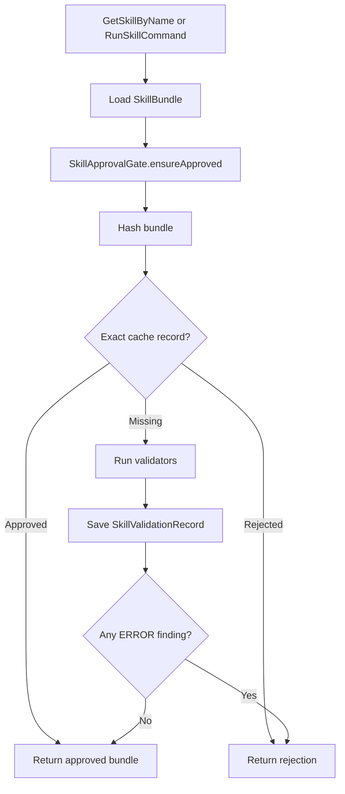
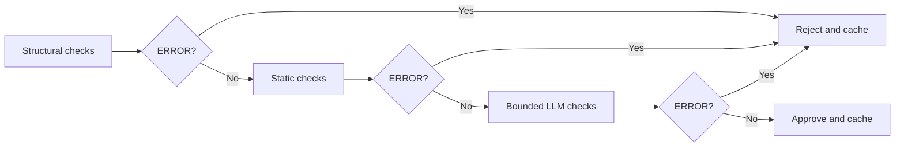

# Skill Validation

This package is the approval boundary for file-backed Skill bundles.

Discovery and execution load a `SkillBundle` first, then call `SkillApprovalGate` before exposing
`SKILL.md` or running bundled commands. The gate hashes the bundle, checks the exact validation
cache, runs validators on a miss, stores the result, and returns either an approved bundle or a
local rejection.

## Validator Chain

Validators run in a fixed order. Later validators receive earlier findings. The chain stops after
the first `ERROR`, so expensive checks do not run after a hard failure.

## Rules

- Validation cache identity is `userId`, `skillId`, `bundleHash`, and `policyVersion`.
- A changed bundle or policy is a cache miss.
- Validators return `SkillValidationFinding` values.
- Any `ERROR` finding rejects the bundle.
- `SkillApprovalGate` caches both approvals and rejections for the exact identity.
- Validation order is structural checks, static checks, then bounded LLM checks.
- Validator failures fail closed.
- Coroutine cancellation is rethrown.
- Bundle discovery and loading stay outside this package.
